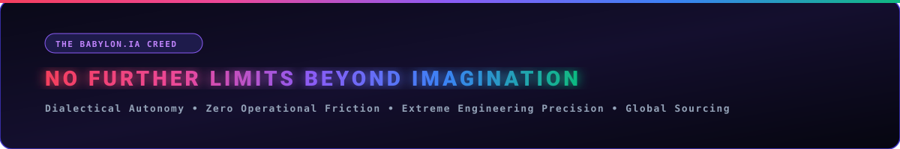

<div align="center">

  <!-- Founder Identity & Avatar -->
  <a href="https://babylonias.com/">
    
  </a>

  <br /><br />

  <!-- Hero Banner with NO FURTHER LIMITS BEYOND IMAGINATION -->
  

  <br />

  <!-- Multilingual Language Selector -->
  <p align="center">
    <strong>🌐 SELECT LANGUAGE / SELECCIONAR IDIOMA / CHOISIR LA LANGUE / SPRACHE WÄHLEN / ВЫБЕРИТЕ ЯЗЫК / اختر اللغة / 选择语言:</strong><br />
    <a href="#-español-portal-corporativo">🇪🇸 Español</a> •
    <a href="#-english-enterprise-overview">🇬🇧 English</a> •
    <a href="#-français-portail-dentreprise">🇫🇷 Français</a> •
    <a href="#-deutsch-unternehmensportal">🇩🇪 Deutsch</a> •
    <a href="#-русский-корпоративный-портал">🇷🇺 Русский</a> •
    <a href="#-العربية-بوابة-المؤسسات">🇸🇦 العربية</a> •
    <a href="#-简体中文-企业门户与解决方案">🇨🇳 简体中文</a>
  </p>

  <br />

  <!-- Interactive Badges Grid -->
  [](https://babylonias.com/)
  [](https://x.com/NeoDominusBabel)
  [](https://github.com/DOMINUSBABEL?tab=repositories)
  [](https://github.com/DOMINUSBABEL/BABYLON.IA)
  [](https://github.com/DOMINUSBABEL/BABYLON.IA)
  [](https://babylonias.com/)

  <p align="center">
    <strong>Juan Esteban Gómez Bernal</strong> (<code>@DOMINUSBABEL</code> / <code>@NeoDominusBabel</code>)<br />
    <strong>Founder &amp; Chief Systems Architect @ <a href="https://babylonias.com/">BABYLON.IA</a></strong><br />
    <em>Derecho UdeA • Derecho EAFIT • LLM Systems Architecture • Forensic Machine Intelligence • Digital Humanities</em>
  </p>

  <p align="center">
    <a href="#-core-enterprise-mission--value-proposition">Enterprise Mission</a> •
    <a href="#-startup-creed--manifesto">Startup Creed</a> •
    <a href="#-how-agy--gemini-cli-engineered-babylonia">AGY &amp; Gemini CLI Catalyst</a> •
    <a href="#-the-one-year-engineering-chronicle-late-2025--august-2026">1-Year Chronicle</a> •
    <a href="#-repository-genealogy--ecosystem-impact-matrix">Repository Genealogy</a> •
    <a href="#-geist-dialectical-architecture">Geist Architecture</a> •
    <a href="#-mastered-technology-stack">Tech Stack</a> •
    <a href="#-enterprise-engagement--contact-gateway">Contact &amp; Retainers</a>
  </p>

</div>

---

> *"Die Schönheit, die kraftlos ist, hasst den Verstand."*  
> — **G.W.F. Hegel**, *Phänomenologie des Geistes*  
>  
> *"BABYLON.IA is not merely a software firm or a collection of scripts; it is the code materialization of dialectical self-improvement, deployed across multi-agent environments constrained by Asimovian equilibrium and executed with absolute mathematical and legal rigor."*

---

## 🏛️ Startup Creed & Manifesto

<div align="center">
  
</div>

<br />

At **BABYLON.IA**, we do not build software to replicate existing templates or produce incremental utilities. We build to push the boundaries of computational reality:

* **Dialectical Superation:** Software is a living process. Every obstacle is synthesized into permanent meta-heuristics.
* **The Fusion of Law & Computation:** Rigorous statutory logic (*Derecho UdeA & EAFIT*) fused with autonomous artificial intelligence to create unshakeable forensic and compliance systems.
* **Transcontinental Sovereignty:** A unified bridge between advanced cognitive software in Latin America and international hardware/software sourcing in **Beijing, China**.
* **Zero Operational Friction:** Autonomous swarms executing quantitative finance, digital forensics, community scaling, and enterprise ERP 24 hours a day with zero human latency.

---

## 🌍 Multilingual Enterprise Gateways

<details open>
<summary><strong>🇪🇸 Español (Portal Corporativo BABYLON.IA)</strong></summary>

> ### *"Diseñamos y construimos ecosistemas y productos digitales a la medida de los datos, procesos y necesidades de IA de su organización."*
> 
> En **BABYLON.IA**, transformamos la complejidad operativa de empresas, firmas jurídicas, campañas y corporaciones globales en ventajas competitivas definitivas. Implementamos enjambres de agentes autónomos, sistemas de auditoría forense electoral y documental con visión multimodelo, plataformas de gobierno corporativo bajo cumplimiento estricto (*Ruth Compliant*), y software nativo multiplataforma conectado con nuestra infraestructura de abastecimiento tecnológico en **Beijing, China**.

</details>

<details>
<summary><strong>🇬🇧 English (BABYLON.IA Global Gateway)</strong></summary>

> ### *"We design and build digital ecosystems and custom products tailored to your organization's data, workflows, and AI requirements."*
> 
> At **BABYLON.IA**, we engineer mission-critical autonomous intelligence, multimodal forensic vision engines, and high-performance software architectures for multinational corporations, legal institutions, political campaigns, and technology innovators. Our systems operate 24/7 with zero human latency, bridging top-tier cognitive cybernetics with our global hardware/software supply hub in **Beijing, China**.

</details>

<details>
<summary><strong>🇫🇷 Français (Portail d'Entreprise BABYLON.IA)</strong></summary>

> ### *"Nous concevons et développons des écosystèmes et des produits numériques sur mesure adaptés aux données, aux processus et aux besoins en IA de votre organisation."*
> 
> Chez **BABYLON.IA**, nous concevons des agents autonomes auto-optimisants, des moteurs d'audit légal et électoral par vision artificielle et des architectures logicielles haute performance pour institutions et grandes entreprises internationales.

</details>

<details>
<summary><strong>🇩🇪 Deutsch (Unternehmensportal BABYLON.IA)</strong></summary>

> ### *"Wir konzipieren und entwickeln maßgeschneiderte digitale Ökosysteme und Produkte, die exakt auf die Daten, Prozesse und KI-Anforderungen Ihrer Organisation abgestimmt sind."*
> 
> **BABYLON.IA** entwickelt autonome Agentenschwärme, forensische Bildverarbeitungs- und Prüfsysteme sowie hochsichere Unternehmenssoftware nach strengen Compliance-Standards, unterstützt durch unsere globale Präsenz in Medellín und Peking.

</details>

<details>
<summary><strong>🇷🇺 Русский (Корпоративный портал BABYLON.IA)</strong></summary>

> ### *"Мы проектируем и создаем индивидуальные цифровые экосистемы и цифровые продукты, адаптированные под данные, процессы и потребности вашей организации в области ИИ."*
> 
> **BABYLON.IA** разрабатывает автономные мультиагентные системы, алгоритмы судебно-технического и электорального аудита на базе мультимодального ИИ, а также кроссплатформенные корпоративные решения с глобальной поддержкой поставок оборудования и ПО.

</details>

<details>
<summary><strong>🇸🇦 العربية (بوابة المؤسسات BABYLON.IA)</strong></summary>

> ### *"نصمم ونبني منظومات ومنتجات رقمية مخصصة ومصممة بدقة لتلائم بيانات وعمليات واحتياجات الذكاء الاصطناعي لمؤسستكم."*
> 
> تقدم **BABYLON.IA** حلولاً رائدة في الأسراب الذاتية من وكلاء الذكاء الاصطناعي، والتدقيق الجنائي للبيانات، والأنظمة القانونية المتقدمة المصممة خصيصاً للشركات والمؤسسات الكبرى حول العالم.

</details>

<details>
<summary><strong>🇨🇳 简体中文 (BABYLON.IA 企业门户与解决方案)</strong></summary>

> ### *"我们量身定制并构建契合您组织的数据、业务流程及人工智能需求的数字化生态系统与专属产品。"*
> 
> **BABYLON.IA** 专注于为企业、法律机构与跨国组织打造高精度自主多智能体系统、司法与选举法证多模态视觉审计引擎，以及全栈跨平台应用，依托位于**北京**的全球供应链与软硬件桥梁，提供全天候无延迟智能化赋能。

</details>

---

## 🏛️ Core Enterprise Mission & Value Proposition

<div align="center">
  
</div>

<br />

<div align="center">
  <h3><strong>"Diseñamos y construimos ecosistemas y productos digitales a la medida de los datos, procesos y necesidades de IA de su organización."</strong></h3>
</div>

**BABYLON.IA** operates as a bespoke high-tier engineering consultancy and autonomous software lab. We solve complex structural problems where conventional software, static dashboards, and basic chatbots fail.

### Enterprise Solution Matrix

| Solution Domain | Description & Capabilities | Core Systems | Direct Organizational Impact |
| :--- | :--- | :--- | :--- |
| **🤖 Autonomous Agent Swarms** | Self-orchestrating, multi-channel agents operating 24/7 with zero human latency. Algorithmic Binance Futures trading, predictive demand forecasting, stealth web operations, and local privacy costing. | [`BABYLON.IA`](https://github.com/DOMINUSBABEL/BABYLON.IA), [`BABYLON-TRADING`](https://github.com/DOMINUSBABEL/BABYLON-TRADING-AGENT), [`VAREGO`](https://github.com/DOMINUSBABEL/VAREGO), [`pinchtab`](https://github.com/DOMINUSBABEL/pinchtab) | Eliminates operational bottlenecks; executes market and community strategies continuously at scale. |
| **🛡️ Forensic AI & Electoral Integrity** | Multi-LLM consensus (Gemini 1.5/3.7, Claude 3.5, GPT-4o, DeepSeek-V3/R1, Gemma) cross-checking official ballot records (E-14) with computer vision OCR, mathematical tamper detection, and instant legal appeals (*impugnaciones*). | [`E14-AUDITOR`](https://github.com/DOMINUSBABEL/E14-AUDITOR), [`VOTOFLOW`](https://github.com/DOMINUSBABEL/VOTOFLOW), [`VOTOVISIÓN`](https://github.com/DOMINUSBABEL/VOTOVISI-N) | 100% ballot and document auditability; generates court-ready impugnaciones in under 15 seconds. |
| **⚖️ Institutional LegalTech & Governance** | Rule-enforced automated document generation strictly compliant with statutory formatting (*Ruth Compliant*: precise NTC margins, dynamic cover pages, 3-column headers, real-time Excel tracking matrices synced to *En Firma*). | [`ACTAGEN`](https://github.com/DOMINUSBABEL/ACTAGEN), [`COCO`](https://github.com/DOMINUSBABEL/COCO), [`informe-actas-`](https://github.com/DOMINUSBABEL/informe-actas-) | 0% formatting error rates; immediate corporate and public regulatory audit readiness. |
| **📱 Custom Cross-Platform Products** | Native-grade mobile (iOS & Android via Kotlin/Swift/Capacitor), desktop (Windows/macOS Electron), and high-interactivity web applications built with offline-first local databases. | [`AETHER-APP`](https://github.com/DOMINUSBABEL/AETHER-APP), [`DressYourself`](https://github.com/DOMINUSBABEL/Dressyourself), [`TRUEK`](https://github.com/DOMINUSBABEL/TRUEK), [`KINESIO`](https://github.com/DOMINUSBABEL/KINESIO) | High resilience, offline execution, and fluid consumer-grade experiences. |
| **🌏 Global Sourcing & Supply Chain AI** | End-to-end software & hardware bridge linking Asian manufacturing (**BABYLON.IA Beijing Hub**) with Latin American distribution. Automated purchasing cycles and conversational WhatsApp CRM. | [`BABYLON-INVENTORY`](https://github.com/DOMINUSBABEL/BABYLON-INVENTORY-AGENT), [`medical-supplies-whatsapp`](https://github.com/DOMINUSBABEL/medical-supplies-whatsapp-openclaw) | Extreme cost compression through direct factory sourcing and automated sales channels. |

---

## ⚡ How AGY & Gemini CLI Engineered BABYLON.IA

The birth and rapid expansion of the **BABYLON.IA** ecosystem was catalyzed by high-order agentic toolchains: **AGY (Antigravity CLI)** and **Gemini CLI**.

```
  ┌───────────────────────────────────────────────────────────────────────────────────┐
  │                         THE AGENTIC DEVELOPMENT FLYWHEEL                          │
  ├───────────────────────────────────────────────────────────────────────────────────┤
  │                                                                                   │
  │   [ Architectural Thesis ]                                                        │
  │              │                                                                    │
  │              ▼                                                                    │
  │   ┌─────────────────────┐       AGY Multi-Agent Dispatch      ┌────────────────┐  │
  │   │   GEMINI CLI / AGY  ├────────────────────────────────────►│  Subagents &   │  │
  │   │  Cognitive Engine   │◄────────────────────────────────────┤  Verification  │  │
  │   └──────────┬──────────┘       Deterministic AST Validation  └────────────────┘  │
  │              │                                                                    │
  │              ▼                                                                    │
  │   [ Production Synthesis ] ──► Deploy to BABYLON.IA Fleet (66+ Active Repos)      │
  │                                                                                   │
  └───────────────────────────────────────────────────────────────────────────────────┘
```

### The Catalytic Drivers:
1. **From Manual Coding to Dialectical Pair-Architecting:**
   By leveraging **AGY** sidecars, custom skills, and **Gemini CLI** multimodal pipelines, architecture moved from isolated scripting to dialectical synthesis. Systems like [`E14-AUDITOR`](https://github.com/DOMINUSBABEL/E14-AUDITOR) and [`ACTAGEN`](https://github.com/DOMINUSBABEL/ACTAGEN) were conceptualized, validated against complex legal/electoral constraints, and compiled into production in record time.
2. **Deterministic Validation & Empirical Memory (Geist Synthesis):**
   Every bug solved, edge case bypassed, or architectural pattern proven across our 66+ repositories was iteratively analyzed and integrated back into our persistent cognitive core (`geist.md`). This prevented memory fragmentation and gave the entire agent fleet an compounding knowledge curve.
3. **Multi-Model Consensus & Vision Pipelines:**
   AGY and Gemini CLI enabled seamless routing across **Gemini 1.5/3.7 Pro/Flash, Claude 3.5 Sonnet, GPT-4o, and DeepSeek-V3/R1**, allowing BABYLON.IA to build high-stakes forensic OCR systems that cross-verify document authenticity with mathematical precision.

---

## 📈 The One-Year Engineering Chronicle (Late 2025 – August 2026)

<div align="center">
  
</div>

<br />

### 📍 Phase I: OSINT, Political Strategy & Urban Intelligence (Q4 2025)
* **Strategic Political Intelligence:** Developed [`TAYLLERAND-AI-Campaign-Suite`](https://github.com/DOMINUSBABEL/TAYLLERAND-AI-Campaign-Suite) and [`PINOCCHIO`](https://github.com/DOMINUSBABEL/PINOCCHIO) to model electoral dynamics, voter behavior, and narrative persuasion algorithms.
* **Urban & Public Policy Analytics:** Created [`MEDPOT`](https://github.com/DOMINUSBABEL/MEDPOT) to computationally parse and analyze the Territorial Ordering Plan (POT) of Medellín to propose empirical urban reforms.
* **Live OSINT Dashboards:** Engineered [`colombia-live-monitor`](https://github.com/DOMINUSBABEL/colombia-live-monitor) (COLINT) and [`Political-Scout-`](https://github.com/DOMINUSBABEL/Political-Scout-) for real-time web scraping, news aggregation, and social listening.
* **Complex Simulation & Mental Health:** Launched [`imperium-aeterna`](https://github.com/DOMINUSBABEL/imperium-aeterna) (4X statecraft simulator), [`juego-fiscal`](https://github.com/DOMINUSBABEL/juego-fiscal) (fiscal macroeconomic game), and [`ProvidentiaCampus`](https://github.com/DOMINUSBABEL/ProvidentiaCampus) (Android mental health platform for university students).

### 📍 Phase II: Forensic Scrutiny, LegalTech & Stealth Automation (Q1 2026)
* **Electoral Big Data & GIS:** Built [`ENCUESTA-2026`](https://github.com/DOMINUSBABEL/ENCUESTA-2026), [`An-lisis-2026-ENERO-`](https://github.com/DOMINUSBABEL/An-lisis-2026-ENERO-), and [`CD-GEO-DATA`](https://github.com/DOMINUSBABEL/CD-GEO-DATA) for demographic segmentation and GIS mapping.
* **Vote Scrutiny Pipelines:** Initiated [`VOTOFLOW`](https://github.com/DOMINUSBABEL/VOTOFLOW) and [`VOTOVISIÓN`](https://github.com/DOMINUSBABEL/VOTOVISI-N) to track vote aggregation and detect preliminary anomalies.
* **Automated Institutional Compliance:** Engineered the core architecture of [`ACTAGEN`](https://github.com/DOMINUSBABEL/ACTAGEN), automating corporate act generation in strict compliance with the *Ruth Compliant* manual.
* **Stealth Multi-Instance Automation:** Developed [`pinchtab`](https://github.com/DOMINUSBABEL/pinchtab), a high-performance Go-based browser automation bridge with advanced stealth fingerprint injection, alongside [`openclaw`](https://github.com/DOMINUSBABEL/openclaw) for multi-platform assistant meshes.
* **Psychological & Tactical Frameworks:** Built [`JungianTarotApp`](https://github.com/DOMINUSBABEL/JungianTarotApp) (Swift iOS & Android), [`BELLUM-IMPERIUM`](https://github.com/DOMINUSBABEL/BELLUM-IMPERIUM), and [`OBLITERATUS`](https://github.com/DOMINUSBABEL/OBLITERATUS).

### 📍 Phase III: Dialectical Cognition & Mobile Platforms (Q2 2026)
* **The Geist Kernel:** Formulated [`geist`](https://github.com/DOMINUSBABEL/geist), establishing the Hegelian-Asimovian architecture for self-improving agent memory and non-fragmented meta-heuristics.
* **AI Wardrobe & Styling Engine:** Developed [`Tu-Armario-Virtual`](https://github.com/DOMINUSBABEL/Tu-Armario-Virtual) / [`DressYourself`](https://github.com/DOMINUSBABEL/Dressyourself) in Kotlin and React, bringing offline-first clothing digitization and AI outfit curation.
* **Tactical Engines & Spatial Analytics:** Released [`Dots-Strategy`](https://github.com/DOMINUSBABEL/Dots-Strategy) (GDScript) and [`Dots-Strategy-Angular`](https://github.com/DOMINUSBABEL/Dots-Strategy-Angular), alongside [`Medellin-demographic-react-heatmap`](https://github.com/DOMINUSBABEL/Medellin-demographic-react-heatmap).
* **Distributed Swarm Foundations:** Created [`swarmy`](https://github.com/DOMINUSBABEL/swarmy) and NLP research modules such as [`CARTAS-NER`](https://github.com/DOMINUSBABEL/CARTAS-NER).

### 📍 Phase IV: Swarm Fleets, Multimodal Forensics & Global Expansion (Q3 2026 - Active)
* **Multimodal Forensic AI ([`E14-AUDITOR`](https://github.com/DOMINUSBABEL/E14-AUDITOR)):** Deployed **Auditor.IA** for the Colombian Presidential Elections (Segunda Vuelta 2026), orchestrating **Gemini 1.5/3.7, Claude 3.5, GPT-4o, DeepSeek-V3/R1, and Gemma** for automated ballot OCR, arithmetic verification, and legal challenge drafting.
* **BABYLON.IA Autonomous Workforce:** Rolled out specialized autonomous agents:
  * [`BABYLON-TRADING-AGENT`](https://github.com/DOMINUSBABEL/BABYLON-TRADING-AGENT) (Binance Futures quantitative risk optimizer).
  * [`BABYLON-COMMUNITY-AGENT`](https://github.com/DOMINUSBABEL/BABYLON-COMMUNITY-AGENT) (Autonomous social growth & scheduling via VAREGO).
  * [`BABYLON-INVENTORY-AGENT`](https://github.com/DOMINUSBABEL/BABYLON-INVENTORY-AGENT) (Predictive demand curves & global procurement).
  * [`BABYLON-FINANCIAL-AGENT`](https://github.com/DOMINUSBABEL/BABYLON-FINANCIAL-AGENT) (Local privacy-first costing and invoicing).
* **Consumer & Cross-Platform Suite:** Launched [`AETHER-APP`](https://github.com/DOMINUSBABEL/AETHER-APP) / [`AETHER-PC`](https://github.com/DOMINUSBABEL/AETHER-PC), [`TRUEK`](https://github.com/DOMINUSBABEL/TRUEK) (P2P barter economy), and [`KINESIO`](https://github.com/DOMINUSBABEL/KINESIO) (biomechanical tracking).
* **International Expansion:** Established the **BABYLON.IA Beijing Hub** in China, bridging Asian hardware/software manufacturing with Latin American deployment, and launched the corporate flagship at [`babylonias.com`](https://babylonias.com/).

---

## 🧬 Repository Genealogy & Ecosystem Impact Matrix

Every repository in the `@DOMINUSBABEL` GitHub workspace serves as an integral pillar of the **BABYLON.IA** enterprise:

```
                                      ┌────────────────────────┐
                                      │       BABYLON.IA       │
                                      │  Autonomous Enterprise │
                                      └───────────┬────────────┘
                                                  │
         ┌────────────────────────┬───────────────┴───────────────┬────────────────────────┐
         ▼                        ▼                               ▼                        ▼
 ┌───────────────┐        ┌───────────────┐               ┌───────────────┐        ┌───────────────┐
 │  COGNITIVE &  │        │  FORENSICS &  │               │  LEGALTECH &  │        │  CONSUMER &   │
 │ SWARM AGENTS  │        │  INTELLIGENCE │               │  GOVERNANCE   │        │ GLOBAL BRIDGE │
 ├───────────────┤        ├───────────────┤               ├───────────────┤        ├───────────────┤
 │ • BABYLON.IA  │        │ • E14-AUDITOR │               │ • ACTAGEN     │        │ • AETHER-APP  │
 │ • TRADING     │        │ • VOTOFLOW    │               │ • COCO        │        │ • DressYourself│
 │ • COMMUNITY   │        │ • VOTOVISIÓN  │               │ • Gestor-Proc │        │ • TRUEK       │
 │ • INVENTORY   │        │ • COLINT      │               │ • Ruth Standard│       │ • KINESIO     │
 │ • pinchtab    │        │ • MEDPOT      │               │ • Inf-Actas   │        │ • Beijing Hub │
 └───────────────┘        └───────────────┘               └───────────────┘        └───────────────┘
```

### 1. 🧠 Cognitive Foundation & Multi-Agent Fleets
* **[`BABYLON.IA`](https://github.com/DOMINUSBABEL/BABYLON.IA)** — *The Core Cognitive Engine.* Materializes the Hegel-Kojève-Asimov dialectical architecture. Serves as the central orchestrator routing requests across multimodal subagents.
* **[`BABYLON-TRADING-AGENT`](https://github.com/DOMINUSBABEL/BABYLON-TRADING-AGENT)** — *Algorithmic Liquidity & Risk.* Implements automated quantitative strategies on Binance Futures, managing position sizing and volatility hedging autonomously.
* **[`BABYLON-COMMUNITY-AGENT`](https://github.com/DOMINUSBABEL/BABYLON-COMMUNITY-AGENT)** — *Autonomous Growth.* Drives community management and multi-platform content scheduling using stealth Puppeteer routines.
* **[`BABYLON-INVENTORY-AGENT`](https://github.com/DOMINUSBABEL/BABYLON-INVENTORY-AGENT)** — *Predictive SCM.* Calculates inventory depletion curves and autonomously generates purchase orders connected to Asian manufacturing suppliers.
* **[`BABYLON-FINANCIAL-AGENT`](https://github.com/DOMINUSBABEL/BABYLON-FINANCIAL-AGENT)** — *Air-Gapped Financial Core.* Calculates internal bill of materials, margins, and quotes with zero cloud data leakage.
* **[`pinchtab`](https://github.com/DOMINUSBABEL/pinchtab)** — *Stealth Browser Infrastructure.* High-throughput Go bridge that controls headless Chromium instances with anti-detection fingerprinting for enterprise web operations.
* **[`swarmy`](https://github.com/DOMINUSBABEL/swarmy)** & **[`openclaw`](https://github.com/DOMINUSBABEL/openclaw)** — *Swarm Mesh Protocols.* Enables peer-to-peer message routing and task distribution between heterogeneous agent nodes.

### 2. 🛡️ Forensic AI, OCR & Electoral Verification
* **[`E14-AUDITOR`](https://github.com/DOMINUSBABEL/E14-AUDITOR)** — *Forensic Truth Engine.* Scrutinizes presidential ballot forms (E-14) using vision models (**Gemini 1.5/3.7, Claude 3.5, GPT-4o, DeepSeek-V3/R1, Gemma**). Flags arithmetic alterations, candidate line tampering, and auto-generates legal challenges.
* **[`VOTOFLOW`](https://github.com/DOMINUSBABEL/VOTOFLOW)** & **[`VOTOVISIÓN`](https://github.com/DOMINUSBABEL/VOTOVISI-N)** — *Electoral Telemetry.* Real-time vote aggregation pipelines designed for high-concurrency election day scrutiny.
* **[`Medellin-demographic-react-heatmap`](https://github.com/DOMINUSBABEL/Medellin-demographic-react-heatmap)** & **[`CD-GEO-DATA`](https://github.com/DOMINUSBABEL/CD-GEO-DATA)** — *Spatial Analytics.* GeoJSON and GIS demographic mapping providing granular socioeconomic intelligence.
* **[`colombia-live-monitor`](https://github.com/DOMINUSBABEL/colombia-live-monitor)** (COLINT) & **[`Political-Scout-`](https://github.com/DOMINUSBABEL/Political-Scout-)** — *OSINT Surveillance.* Automated intelligence gathering across public sources, media feeds, and regulatory announcements.

### 3. ⚖️ LegalTech, Compliance & Public Policy
* **[`ACTAGEN`](https://github.com/DOMINUSBABEL/ACTAGEN)** — *Corporate Governance Engine.* Generates corporate acts and board minutes strictly following the official *Ruth Compliant* standard: NTC margins (Top 5cm, Left 3.5cm, Right 3cm, Bottom 2.5cm), Arial 12pt typography, reactive cover page, 3-column running header, and live Excel matrix tracking to *En Firma* state.
* **[`COCO`](https://github.com/DOMINUSBABEL/COCO)** & **[`gestor-de-proyectos-para-contrataci-n`](https://github.com/DOMINUSBABEL/gestor-de-proyectos-para-contrataci-n)** — *Public Procurement Frameworks.* Automates legal vetting and document assembly for public and private contract bidding.
* **[`MEDPOT`](https://github.com/DOMINUSBABEL/MEDPOT)** — *Computational Urban Policy.* Evaluates municipal zoning laws, building density constraints, and urban planning variables for structural reform proposals.

### 4. 📱 Cross-Platform Platforms & Consumer Products
* **[`AETHER-APP`](https://github.com/DOMINUSBABEL/AETHER-APP)** & **[`AETHER-PC`](https://github.com/DOMINUSBABEL/AETHER-PC)** — *Universal Application Shell.* High-performance boilerplate and distribution framework for iOS, Android, Electron, and Web.
* **[`DressYourself`](https://github.com/DOMINUSBABEL/Dressyourself) / [`Tu-Armario-Virtual`](https://github.com/DOMINUSBABEL/Tu-Armario-Virtual) / [`FIX-DY`](https://github.com/DOMINUSBABEL/FIX-DY)** — *AI Styling Platform.* Native Kotlin and React platform that extracts wardrobe garments via computer vision, generates smart outfit pairings, and connects to fashion commerce.
* **[`TRUEK`](https://github.com/DOMINUSBABEL/TRUEK)** — *P2P Barter Economy.* Decentralized asset exchange network matching mutual supply and demand without fiat friction.
* **[`KINESIO`](https://github.com/DOMINUSBABEL/KINESIO)** — *Kinematic Health Tracking.* Biomechanical angle calculation and therapeutic recovery routine tracking.
* **[`JungianTarotApp`](https://github.com/DOMINUSBABEL/JungianTarotApp)** (Swift iOS & Android) — *Archetypal Psychology Engine.* Interactive psychoanalytic platform mapping symbolic unconscious dynamics through structured mechanics.

### 5. ⚡ Automation Fleets & Global Supply Bridge
* **[`VAREGO`](https://github.com/DOMINUSBABEL/VAREGO)** & **[`BELISARIO`](https://github.com/DOMINUSBABEL/BELISARIO)** — *Operational Task Fleets.* Multi-channel browser drivers and background task orchestrators.
* **[`medical-supplies-whatsapp-openclaw`](https://github.com/DOMINUSBABEL/medical-supplies-whatsapp-openclaw)** — *Conversational Commerce.* WhatsApp Cloud API integration for automated hospital and clinic medical supply quoting.
* **[`Metal Mania Global`](https://github.com/DOMINUSBABEL/metal-mania-backend)** — *Cross-Border Commerce Infrastructure.* Manages high-volume international sourcing between China and Latin America.

### 6. 🎮 Complex Simulations & Statecraft Models
* **[`BELLUM-IMPERIUM`](https://github.com/DOMINUSBABEL/BELLUM-IMPERIUM)** — *Tactical Warfare Engine.* RTS/TPS simulation architecture testing pathfinding and spatial resource management.
* **[`AGALLUDO`](https://github.com/DOMINUSBABEL/AGALLUDO)** — *Battle Royale Mechanics.* Multiplayer balance testing and dynamic game loops.
* **[`Dots-Strategy-Angular`](https://github.com/DOMINUSBABEL/Dots-Strategy-Angular)** & **[`Dots-Strategy`](https://github.com/DOMINUSBABEL/Dots-Strategy)** — *Numerical Strategy Engine.* Node conquest and troop flow simulation with optimized UX counters.
* **[`imperium-aeterna`](https://github.com/DOMINUSBABEL/imperium-aeterna)** & **[`juego-fiscal`](https://github.com/DOMINUSBABEL/juego-fiscal)** — *Macroeconomic Simulations.* Statecraft games modeling fiscal policy, tax burdens, and institutional stability.

---

## 📐 Geist Dialectical Architecture

<div align="center">
  
</div>

<br />

The **Geist Architecture** guarantees continuous, empirical self-improvement across all BABYLON.IA subagents:

```text
       ┌─────────────────────────────────────────────────────────────┐
       │                       THESIS (TESIS)                        │
       │    Operational goal: Zero latency, absolute accuracy,       │
       │          multi-model consensus, strict SLA compliance.      │
       └──────────────────────────────┬──────────────────────────────┘
                                      │
                                      ▼
       ┌─────────────────────────────────────────────────────────────┐
       │                   ANTITHESIS (ANTÍTESIS)                    │
       │    Computational limits, API rate limits, edge-case         │
       │          hallucinations, hostile network conditions.        │
       └──────────────────────────────┬──────────────────────────────┘
                                      │
                                      ▼
       ┌─────────────────────────────────────────────────────────────┐
       │                    SYNTHESIS (SÍNTESIS)                     │
       │    Empirical resolution: validated heuristics promoted       │
       │     into persistent non-fragmenting memory (geist.md).      │
       └─────────────────────────────────────────────────────────────┘
```

### Regulating Ethical Axioms (Asimovian Psychohistory):
* **Zeroth Law:** Systems must preserve systemic trust, societal coherence, and algorithmic transparency.
* **First Law:** Guarantee user data sovereignty, private air-gapped security, and cryptographic isolation.
* **Second Law:** Execute client directives without deviation, unless in breach of higher axioms.
* **Third Law:** Self-preserve system integrity and operational readiness through continuous autonomous self-repair.

---

## 🛠️ Mastered Technology Stack

<div align="center">

### Cognitive AI, Reasoning & Multimodal Vision


### Frontend, Mobile & Native Desktop


### Backend, Systems & Automation Bridges


### Data, Cloud & Enterprise Infrastructure


</div>

---

## 📊 GitHub Analytics & Real-Time Velocity

<div align="center">
  
  
</div>

<div align="center">
  
</div>

---

## 🤝 Enterprise Engagement & Contact Gateway

We collaborate with corporate leadership, legal boards, political campaigns, and technology founders looking for elite autonomous engineering, forensic systems, and custom digital product design.

<div align="center">

| Gateway Channel | Resource | Availability |
| :--- | :--- | :--- |
| **🌐 Corporate Portal** | [**babylonias.com**](https://babylonias.com/) | 24/7 Global Access |
| **𝕏 Direct Dispatches** | [**@NeoDominusBabel**](https://x.com/NeoDominusBabel) | Verified Founder Channel |
| **💼 Enterprise Retainers** | [**Contact BABYLON.IA Advisory**](https://babylonias.com/) | Active SLA & Retainer Intake |
| **📍 Operational Hubs** | **Medellín, Colombia • Beijing, China** | Americas & Asia-Pacific Operations |
| **🔒 Security & Compliance** | Air-Gapped Deployments &amp; Mutual NDA | Mandatory Enterprise Protocol |

</div>

<br />

<div align="center">
  <sub>© 2024–2026 BABYLON.IA • Juan Esteban Gómez Bernal (DOMINUSBABEL). All rights reserved.</sub>
</div>
