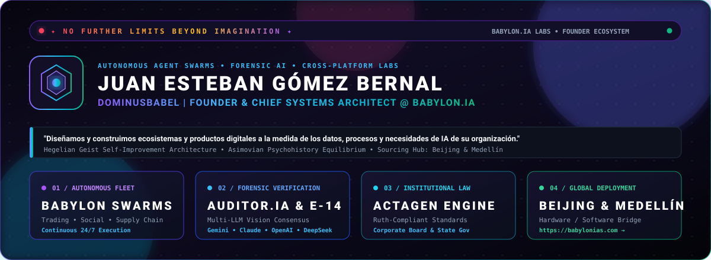
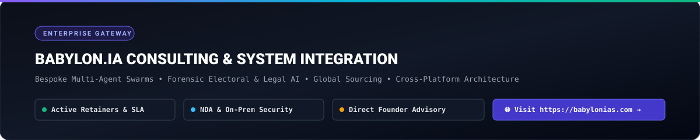
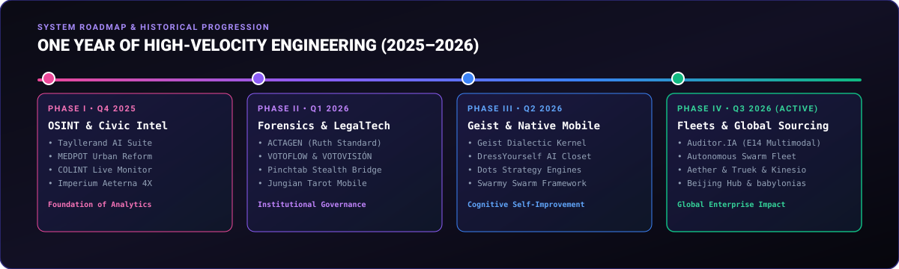
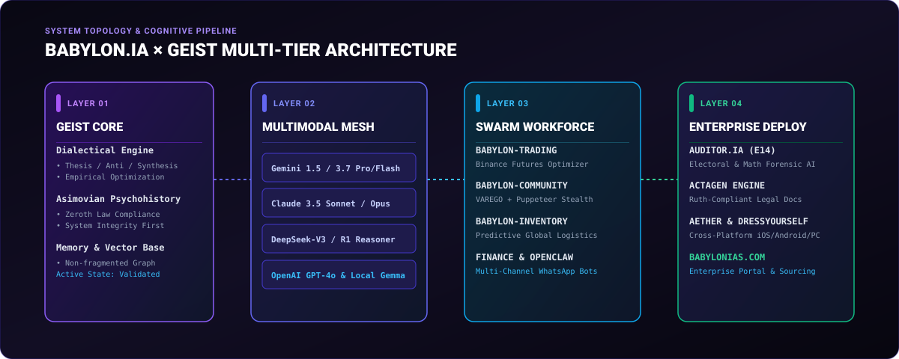

<div align="center">

  <a href="https://babylonias.com/">
    
  </a>

  <br /><br />

  

  <br />

  [](https://babylonias.com/)
  [](https://x.com/NeoDominusBabel)
  [](https://github.com/DOMINUSBABEL?tab=repositories)
  [](https://github.com/DOMINUSBABEL/BABYLON.IA)
  [](https://babylonias.com/)

  <p align="center">
    <strong>Juan Esteban Gómez Bernal</strong> (<code>@DOMINUSBABEL</code> / <code>@NeoDominusBabel</code>)<br />
    <strong>Founder &amp; Chief Systems Architect @ <a href="https://babylonias.com/">BABYLON.IA</a></strong><br />
    <em>Derecho UdeA • Derecho EAFIT • LLM Systems Engineering • Forensic AI • Digital Humanities</em>
  </p>

  <p align="center">
    <a href="#-client-portal--enterprise-solutions-babylonia">Client Portal</a> •
    <a href="#-the-one-year-engineering-chronicle-late-2025--august-2026">1-Year Chronicle</a> •
    <a href="#-flagship-ecosystem--project-index">Flagship Ecosystem</a> •
    <a href="#-geist-dialectical-architecture">Geist Architecture</a> •
    <a href="#-mastered-technology-stack">Technology Stack</a> •
    <a href="#-enterprise-engagement--contact-gateway">Contact &amp; Consulting</a>
  </p>

</div>

---

> *"Die Schönheit, die kraftlos ist, hasst den Verstand."*  
> — **G.W.F. Hegel**, *Phänomenologie des Geistes*  
>  
> *"BABYLON.IA is not just a company or a codebase; it is the material synthesis of dialectical self-improvement, deployed across multi-agent environments constrained by Asimovian equilibrium and executed with absolute mathematical rigor."*

---

## 🏛️ Client Portal & Enterprise Solutions (BABYLON.IA)

<div align="center">
  
</div>

<br />

**BABYLON.IA** provides elite institutional consulting, bespoke autonomous agent swarms, forensic machine intelligence, and high-performance software engineering for corporations, legal organizations, political organizations, and global enterprises.

### Core Institutional Offerings

| Solution Vector | Capability & Scope | Key Implementations | Enterprise Value |
| :--- | :--- | :--- | :--- |
| **🤖 Autonomous Agent Swarms** | 24/7 self-orchestrating agent mesh. Autonomous algorithmic trading, predictive inventory forecasting, multi-channel browser automation, and privacy-first local financial accounting. | [`BABYLON.IA`](https://github.com/DOMINUSBABEL/BABYLON.IA), [`BABYLON-TRADING`](https://github.com/DOMINUSBABEL/BABYLON-TRADING-AGENT), [`VAREGO`](https://github.com/DOMINUSBABEL/VAREGO) | Total operational autonomy; zero-latency response across financial and social pipelines. |
| **🛡️ Forensic AI & Electoral Auditing** | Multimodal computer vision & OCR algorithms cross-referencing ballot tables (E-14) against official registers. Arithmetic fraud detection, hash integrity verification, and automatic legal appeal (*impugnación*) generation. | [`E14-AUDITOR`](https://github.com/DOMINUSBABEL/E14-AUDITOR), [`VOTOFLOW`](https://github.com/DOMINUSBABEL/VOTOFLOW), [`VOTOVISIÓN`](https://github.com/DOMINUSBABEL/VOTOVISI-N) | 100% ballot scrutiny rate across nationwide datasets; immediate legal enforceability. |
| **⚖️ Institutional LegalTech & Governance** | Automated corporate act & board minutes generation strictly compliant with statutory formatting (*Ruth Compliant*: NTC margins, dynamic cover pages, 3-column headers, real-time Excel tracking matrices). | [`ACTAGEN`](https://github.com/DOMINUSBABEL/ACTAGEN) | Zero formatting penalties; guaranteed compliance with regulatory and corporate bylaws. |
| **📱 Cross-Platform Ecosystems** | Native-performance mobile (iOS & Android), desktop (Windows Electron), and web architectures built with offline-first local databases and responsive UX. | [`AETHER-APP`](https://github.com/DOMINUSBABEL/AETHER-APP), [`DressYourself`](https://github.com/DOMINUSBABEL/Dressyourself), [`TRUEK`](https://github.com/DOMINUSBABEL/TRUEK), [`KINESIO`](https://github.com/DOMINUSBABEL/KINESIO) | Seamless deployment across consumer and enterprise device fleets. |
| **🌏 Global Sourcing & Supply Chain AI** | End-to-end hardware/software bridge between Asia and Latin America. International procurement automation, factory sourcing from China (Beijing Office), and WhatsApp CRM integration. | [`BABYLON-INVENTORY`](https://github.com/DOMINUSBABEL/BABYLON-INVENTORY-AGENT), [`medical-supplies-whatsapp`](https://github.com/DOMINUSBABEL/medical-supplies-whatsapp-openclaw) | Direct factory-to-market cost compression; automated high-volume conversational commerce. |

### Enterprise Engagement Lifecycle
1. **Deep Audit & Needs Assessment:** Formal evaluation of client workflows, bottlenecks, and compliance parameters.
2. **Custom Model & Cognitive Tailoring:** Fine-tuning multi-model LLM ensembles (Gemini, Claude, GPT-4o, DeepSeek) to the client's proprietary knowledge base.
3. **Swarm Deployment:** Cloud, On-Premise, or Air-Gapped installation under strict mutual NDAs.
4. **Continuous Dialectical Optimization:** Continuous performance refinement backed by SLA and dedicated engineering retainers.

👉 **Ready to deploy BABYLON.IA systems in your organization?** Visit **[babylonias.com](https://babylonias.com/)** or [reach out directly](#-enterprise-engagement--contact-gateway).

---

## 📈 The One-Year Engineering Chronicle (Late 2025 – August 2026)

<div align="center">
  
</div>

<br />

Over the past year, our GitHub workspace has expanded to over **66 repositories**, spanning cutting-edge research, forensic verification engines, mobile applications, and enterprise automation:

### 📍 Phase I: OSINT, Political Strategy & Urban Modeling (Q4 2025)
* **Strategic Political Intelligence:** Developed [`TAYLLERAND-AI-Campaign-Suite`](https://github.com/DOMINUSBABEL/TAYLLERAND-AI-Campaign-Suite) and [`PINOCCHIO`](https://github.com/DOMINUSBABEL/PINOCCHIO) to model electoral dynamics, voter behavior, and narrative persuasion algorithms.
* **Urban & Public Policy Analytics:** Created [`MEDPOT`](https://github.com/DOMINUSBABEL/MEDPOT) to computationally parse and analyze the Territorial Ordering Plan (POT) of Medellín to propose empirical urban reforms.
* **Live OSINT Dashboards:** Engineered [`colombia-live-monitor`](https://github.com/DOMINUSBABEL/colombia-live-monitor) (COLINT) and [`Political-Scout-`](https://github.com/DOMINUSBABEL/Political-Scout-) for real-time web scraping, news aggregation, and social listening.
* **Complex Simulation & Mental Health:** Launched [`imperium-aeterna`](https://github.com/DOMINUSBABEL/imperium-aeterna) (4X statecraft simulator), [`juego-fiscal`](https://github.com/DOMINUSBABEL/juego-fiscal) (fiscal macroeconomic game), and [`ProvidentiaCampus`](https://github.com/DOMINUSBABEL/ProvidentiaCampus) (Android mental health platform for university students).

### 📍 Phase II: Forensic Scrutiny, LegalTech & Stealth Automation (Q1 2026)
* **Electoral Big Data & GIS:** Built [`ENCUESTA-2026`](https://github.com/DOMINUSBABEL/ENCUESTA-2026), [`An-lisis-2026-ENERO-`](https://github.com/DOMINUSBABEL/An-lisis-2026-ENERO-), and [`CD-GEO-DATA`](https://github.com/DOMINUSBABEL/CD-GEO-DATA) for demographic segmentation and GIS mapping.
* **Vote Scrutiny Pipelines:** Initiated [`VOTOFLOW`](https://github.com/DOMINUSBABEL/VOTOFLOW) and [`VOTOVISIÓN`](https://github.com/DOMINUSBABEL/VOTOVISI-N) to track vote aggregation and detect preliminary anomalies.
* **Automated Institutional Compliance:** Engineered the core architecture of [`ACTAGEN`](https://github.com/DOMINUSBABEL/ACTAGEN), automating corporate act generation in strict compliance with the *Ruth Compliant* manual.
* **Stealth Multi-Instance Automation:** Developed [`pinchtab`](https://github.com/DOMINUSBABEL/pinchtab), a high-performance Go-based browser automation bridge with advanced stealth fingerprint injection, alongside [`openclaw`](https://github.com/DOMINUSBABEL/openclaw) for multi-platform assistant meshes.
* **Psychological & Tactical Frameworks:** Built [`JungianTarotApp`](https://github.com/DOMINUSBABEL/JungianTarotApp) (Swift iOS & Android), [`BELLUM-IMPERIUM`](https://github.com/DOMINUSBABEL/BELLUM-IMPERIUM), and [`OBLITERATUS`](https://github.com/DOMINUSBABEL/OBLITERATUS).

### 📍 Phase III: Dialectical Cognition & Mobile Platforms (Q2 2026)
* **The Geist Kernel:** Formulated [`geist`](https://github.com/DOMINUSBABEL/geist), establishing the Hegelian-Asimovian architecture for self-improving agent memory and non-fragmented meta-heuristics.
* **AI Wardrobe & Styling Engine:** Developed [`Tu-Armario-Virtual`](https://github.com/DOMINUSBABEL/Tu-Armario-Virtual) / [`DressYourself`](https://github.com/DOMINUSBABEL/Dressyourself) in Kotlin and React, bringing offline-first clothing digitization and AI outfit curation.
* **Tactical Engines & Spatial Analytics:** Released [`Dots-Strategy`](https://github.com/DOMINUSBABEL/Dots-Strategy) (GDScript) and [`Dots-Strategy-Angular`](https://github.com/DOMINUSBABEL/Dots-Strategy-Angular), alongside [`Medellin-demographic-react-heatmap`](https://github.com/DOMINUSBABEL/Medellin-demographic-react-heatmap).
* **Distributed Swarm Foundations:** Created [`swarmy`](https://github.com/DOMINUSBABEL/swarmy) and NLP research modules such as [`CARTAS-NER`](https://github.com/DOMINUSBABEL/CARTAS-NER).

### 📍 Phase IV: Swarm Fleets, Multimodal Forensics & Global Expansion (Q3 2026 - Active)
* **Multimodal Forensic AI ([`E14-AUDITOR`](https://github.com/DOMINUSBABEL/E14-AUDITOR)):** Deployed **Auditor.IA** for the Colombian Presidential Elections (Segunda Vuelta 2026), orchestrating **Gemini 1.5/3.7, Claude 3.5, GPT-4o, DeepSeek-V3/R1, and Gemma** for automated ballot OCR, arithmetic verification, and legal challenge drafting.
* **BABYLON.IA Autonomous Workforce:** Rolled out specialized autonomous agents:
  * [`BABYLON-TRADING-AGENT`](https://github.com/DOMINUSBABEL/BABYLON-TRADING-AGENT) (Binance Futures quantitative risk optimizer).
  * [`BABYLON-COMMUNITY-AGENT`](https://github.com/DOMINUSBABEL/BABYLON-COMMUNITY-AGENT) (Autonomous social growth & scheduling via VAREGO).
  * [`BABYLON-INVENTORY-AGENT`](https://github.com/DOMINUSBABEL/BABYLON-INVENTORY-AGENT) (Predictive demand curves & global procurement).
  * [`BABYLON-FINANCIAL-AGENT`](https://github.com/DOMINUSBABEL/BABYLON-FINANCIAL-AGENT) (Local privacy-first costing and invoicing).
* **Consumer & Cross-Platform Suite:** Launched [`AETHER-APP`](https://github.com/DOMINUSBABEL/AETHER-APP) / [`AETHER-PC`](https://github.com/DOMINUSBABEL/AETHER-PC), [`TRUEK`](https://github.com/DOMINUSBABEL/TRUEK) (P2P barter economy), and [`KINESIO`](https://github.com/DOMINUSBABEL/KINESIO) (biomechanical tracking).
* **International Expansion:** Established the **BABYLON.IA Beijing Hub** in China, bridging Asian hardware/software manufacturing with Latin American deployment, and launched the corporate flagship at [`babylonias.com`](https://babylonias.com/).

---

## 🚀 Flagship Ecosystem & Project Index

<div align="center">

| Project | Primary Stack | Domain | Status | Link |
| :--- | :--- | :--- | :---: | :---: |
| **BABYLON.IA** | Python • Node • LLM Mesh | Autonomous Cognitive Engine | 🟢 Production | [`BABYLON.IA`](https://github.com/DOMINUSBABEL/BABYLON.IA) |
| **E14-AUDITOR** | Gemini • Claude • OpenCV • Python | Forensic AI & Electoral OCR | 🟢 Production | [`E14-AUDITOR`](https://github.com/DOMINUSBABEL/E14-AUDITOR) |
| **ACTAGEN** | TypeScript • Office Open XML • Excel | LegalTech & Compliance | 🟢 Production | [`ACTAGEN`](https://github.com/DOMINUSBABEL/ACTAGEN) |
| **BABYLON-TRADING** | Python • Binance API • WebSockets | Quantitative Finance & Futures | 🟢 Active | [`BABYLON-TRADING`](https://github.com/DOMINUSBABEL/BABYLON-TRADING-AGENT) |
| **BABYLON-COMMUNITY**| TypeScript • VAREGO • Puppeteer | Autonomous Community Growth | 🟢 Active | [`BABYLON-COMMUNITY`](https://github.com/DOMINUSBABEL/BABYLON-COMMUNITY-AGENT) |
| **BABYLON-INVENTORY**| TypeScript • Node • SCM Models | Supply Chain & Logistics AI | 🟢 Active | [`BABYLON-INVENTORY`](https://github.com/DOMINUSBABEL/BABYLON-INVENTORY-AGENT) |
| **BABYLON-FINANCIAL**| TypeScript • SQLite • Cryptography | Privacy Costing & Billing | 🟢 Active | [`BABYLON-FINANCIAL`](https://github.com/DOMINUSBABEL/BABYLON-FINANCIAL-AGENT) |
| **pinchtab** | Go • Chrome DevTools Protocol | Stealth Browser Bridge | 🟢 Production | [`pinchtab`](https://github.com/DOMINUSBABEL/pinchtab) |
| **AETHER-APP / PC** | React • Capacitor • Electron | Universal Multiplatform Shell | 🟢 Active | [`AETHER-APP`](https://github.com/DOMINUSBABEL/AETHER-APP) |
| **DressYourself** | Kotlin • React • Computer Vision | AI Wardrobe & Styling | 🟢 Active | [`DressYourself`](https://github.com/DOMINUSBABEL/Dressyourself) |
| **TRUEK** | TypeScript • React • P2P Protocol | Decentralized Barter Economy | 🟢 Active | [`TRUEK`](https://github.com/DOMINUSBABEL/TRUEK) |
| **KINESIO** | TypeScript • Kinematics Engine | Biomechanics & Physical Health | 🟢 Active | [`KINESIO`](https://github.com/DOMINUSBABEL/KINESIO) |
| **VAREGO / BELISARIO**| TypeScript • Browser Automation | Multi-Channel Automation Fleet| 🟢 Active | [`VAREGO`](https://github.com/DOMINUSBABEL/VAREGO) |
| **VOTOFLOW / VISIÓN** | TypeScript • GIS • D3.js | Electoral Big Data Visualization | 🟢 Production | [`VOTOFLOW`](https://github.com/DOMINUSBABEL/VOTOFLOW) |
| **JungianTarotApp** | Swift • SwiftUI • Android Native | Analytical Psychology Engine | 🟢 Production | [`JungianTarot`](https://github.com/DOMINUSBABEL/JungianTarotApp) |

</div>

---

## 📐 Geist Dialectical Architecture

<div align="center">
  
</div>

<br />

The **Geist Architecture** guarantees continuous, validated self-improvement across all BABYLON.IA sub-agents:

```text
       ┌─────────────────────────────────────────────────────────────┐
       │                       THESIS (TESIS)                        │
       │    Operational goal: Zero latency, absolute accuracy,       │
       │          multi-model consensus, strict SLA compliance.      │
       └──────────────────────────────┬──────────────────────────────┘
                                      │
                                      ▼
       ┌─────────────────────────────────────────────────────────────┐
       │                   ANTITHESIS (ANTÍTESIS)                    │
       │    Computational limits, API rate limits, edge-case         │
       │          hallucinations, hostile network conditions.        │
       └──────────────────────────────┬──────────────────────────────┘
                                      │
                                      ▼
       ┌─────────────────────────────────────────────────────────────┐
       │                    SYNTHESIS (SÍNTESIS)                     │
       │    Empirical resolution: validated heuristics promoted       │
       │     into persistent non-fragmenting memory (geist.md).      │
       └─────────────────────────────────────────────────────────────┘
```

### Regulating Ethical Axioms (Asimovian Psychohistory):
* **Zeroth Law:** Systems must preserve systemic trust, societal coherence, and algorithmic transparency.
* **First Law:** Guarantee user data sovereignty, private air-gapped security, and cryptographic isolation.
* **Second Law:** Execute client directives without deviation, unless in breach of higher axioms.
* **Third Law:** Self-preserve system integrity and operational readiness through continuous autonomous self-repair.

---

## 🛠️ Mastered Technology Stack

<div align="center">

### Cognitive AI, Reasoning & Vision


### Frontend, Mobile & Desktop


### Backend, Systems & Automation


### Data, Cloud & Infrastructure


</div>

---

## 📊 GitHub Analytics & Real-Time Velocity

<div align="center">
  
  
</div>

<div align="center">
  
</div>

---

## 🤝 Enterprise Engagement & Contact Gateway

We collaborate with corporate leadership, legal boards, political campaigns, and technology founders looking for elite autonomous engineering and forensic capabilities.

<div align="center">

| Gateway Channel | Resource | Availability |
| :--- | :--- | :--- |
| **🌐 Corporate Portal** | [**babylonias.com**](https://babylonias.com/) | 24/7 Global |
| **𝕏 Direct Dispatches** | [**@NeoDominusBabel**](https://x.com/NeoDominusBabel) | Verified Channel |
| **💼 Enterprise Inquiries** | [**Contact BABYLON.IA Advisory**](https://babylonias.com/) | Active Retainers & SLA |
| **📍 Operational Hubs** | **Medellín, Colombia • Beijing, China** | Americas & Asia-Pacific Coverage |
| **🔒 Security Protocol** | Air-Gapped Deployments &amp; Mutual Non-Disclosure Agreement (NDA) | Mandatory Enterprise Standard |

</div>

<br />

<div align="center">
  <sub>© 2024–2026 BABYLON.IA • Juan Esteban Gómez Bernal (DOMINUSBABEL). All rights reserved.</sub>
</div>
