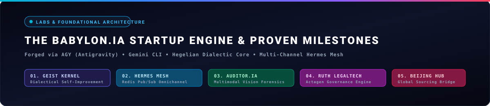

<div align="center">

  <!-- Founder Identity & Avatar -->
  <a href="https://babylonias.com/">
    
  </a>

  <br /><br />

  <!-- Hero Banner with NO FURTHER LIMITS BEYOND IMAGINATION -->
  

  <br />

  <!-- Multilingual Language Selector -->
  <p align="center">
    <strong>🌐 SELECT LANGUAGE / SELECCIONAR IDIOMA / CHOISIR LA LANGUE / SPRACHE WÄHLEN / ВЫБЕРИТЕ ЯЗЫК / اختر اللغة / 选择语言:</strong><br />
    <a href="#-español-portal-corporativo">🇪🇸 Español</a> •
    <a href="#-english-enterprise-overview">🇬🇧 English</a> •
    <a href="#-français-portail-dentreprise">🇫🇷 Français</a> •
    <a href="#-deutsch-unternehmensportal">🇩🇪 Deutsch</a> •
    <a href="#-русский-корпоративный-портал">🇷🇺 Русский</a> •
    <a href="#-العربية-بوابة-المؤسسات">🇸🇦 العربية</a> •
    <a href="#-简体中文-企业门户与解决方案">🇨🇳 简体中文</a>
  </p>

  <br />

  <!-- Interactive Badges Grid -->
  [](https://babylonias.com/)
  [](https://x.com/NeoDominusBabel)
  [](https://github.com/DOMINUSBABEL?tab=repositories)
  [](https://github.com/DOMINUSBABEL/BABYLON.IA)
  [](https://github.com/DOMINUSBABEL/BABYLON.IA)
  [](https://babylonias.com/)

  <p align="center">
    <strong>Juan Esteban Gómez Bernal</strong> (<code>@DOMINUSBABEL</code> / <code>@NeoDominusBabel</code>)<br />
    <strong>Founder &amp; Chief Systems Architect @ <a href="https://babylonias.com/">BABYLON.IA</a></strong><br />
    <em>Derecho UdeA • Derecho EAFIT • LLM Systems Architecture • Forensic Machine Intelligence • Digital Humanities</em>
  </p>

  <p align="center">
    <a href="#-core-enterprise-mission--value-proposition">Enterprise Mission</a> •
    <a href="#-startup-creed--manifesto">Startup Creed</a> •
    <a href="#-startup-showcase--architectural-milestones-agy--gemini-cli-chronicles">Startup Milestones</a> •
    <a href="#-the-one-year-engineering-chronicle-late-2025--august-2026-comprehensive-devlog">1-Year Chronicle &amp; Devlog</a> •
    <a href="#-repository-genealogy--ecosystem-impact-matrix">Repository Genealogy</a> •
    <a href="#-geist-dialectical-architecture">Geist Architecture</a> •
    <a href="#-mastered-technology-stack">Tech Stack</a> •
    <a href="#-enterprise-engagement--contact-gateway">Contact &amp; Retainers</a>
  </p>

</div>

---

> *"Die Schönheit, die kraftlos ist, hasst den Verstand."*  
> — **G.W.F. Hegel**, *Phänomenologie des Geistes*  
>  
> *"BABYLON.IA is not merely a software firm or a collection of scripts; it is the code materialization of dialectical self-improvement, deployed across multi-agent environments constrained by Asimovian equilibrium and executed with absolute mathematical and legal rigor."*

---

## 🏛️ Startup Creed & Manifesto

<div align="center">
  
</div>

<br />

At **BABYLON.IA**, we do not build software to replicate existing templates or produce incremental utilities. We build to push the boundaries of computational reality:

* **Dialectical Superation:** Software is a living process. Every obstacle is synthesized into permanent meta-heuristics.
* **The Fusion of Law & Computation:** Rigorous statutory logic (*Derecho UdeA & EAFIT*) fused with autonomous artificial intelligence to create unshakeable forensic and compliance systems.
* **Transcontinental Sovereignty:** A unified bridge between advanced cognitive software in Latin America and international hardware/software sourcing in **Beijing, China**.
* **Zero Operational Friction:** Autonomous swarms executing quantitative finance, digital forensics, community scaling, and enterprise ERP 24 hours a day with zero human latency.

---

## 🌍 Multilingual Enterprise Gateways

<details open>
<summary><strong>🇪🇸 Español (Portal Corporativo BABYLON.IA)</strong></summary>

> ### *"Diseñamos y construimos ecosistemas y productos digitales a la medida de los datos, procesos y necesidades de IA de su organización."*
> 
> En **BABYLON.IA**, transformamos la complejidad operativa de empresas, firmas jurídicas, campañas y corporaciones globales en ventajas competitivas definitivas. Implementamos enjambres de agentes autónomos, sistemas de auditoría forense electoral y documental con visión multimodelo, plataformas de gobierno corporativo bajo cumplimiento estricto (*Ruth Compliant*), y software nativo multiplataforma conectado con nuestra infraestructura de abastecimiento tecnológico en **Beijing, China**.

</details>

<details>
<summary><strong>🇬🇧 English (BABYLON.IA Global Gateway)</strong></summary>

> ### *"We design and build digital ecosystems and custom products tailored to your organization's data, workflows, and AI requirements."*
> 
> At **BABYLON.IA**, we engineer mission-critical autonomous intelligence, multimodal forensic vision engines, and high-performance software architectures for multinational corporations, legal institutions, political campaigns, and technology innovators. Our systems operate 24/7 with zero human latency, bridging top-tier cognitive cybernetics with our global hardware/software supply hub in **Beijing, China**.

</details>

<details>
<summary><strong>🇫🇷 Français (Portail d'Entreprise BABYLON.IA)</strong></summary>

> ### *"Nous concevons et développons des écosystèmes et des produits numériques sur mesure adaptés aux données, aux processus et aux besoins en IA de votre organisation."*
> 
> Chez **BABYLON.IA**, nous concevons des agents autonomes auto-optimisants, des moteurs d'audit légal et électoral par vision artificielle et des architectures logicielles haute performance pour institutions et grandes entreprises internationales.

</details>

<details>
<summary><strong>🇩🇪 Deutsch (Unternehmensportal BABYLON.IA)</strong></summary>

> ### *"Wir konzipieren und entwickeln maßgeschneiderte digitale Ökosysteme und Produkte, die exakt auf die Daten, Prozesse und KI-Anforderungen Ihrer Organisation abgestimmt sind."*
> 
> **BABYLON.IA** entwickelt autonome Agentenschwärme, forensische Bildverarbeitungs- und Prüfsysteme sowie hochsichere Unternehmenssoftware nach strengen Compliance-Standards, unterstützt durch unsere globale Präsenz in Medellín und Peking.

</details>

<details>
<summary><strong>🇷🇺 Русский (Корпоративный портал BABYLON.IA)</strong></summary>

> ### *"Мы проектируем и создаем индивидуальные цифровые экосистемы и цифровые продукты, адаптированные под данные, процессы и потребности вашей организации в области ИИ."*
> 
> **BABYLON.IA** разрабатывает автономные мультиагентные системы, алгоритмы судебно-технического и электорального аудита на базе мультимодального ИИ, а также кроссплатформенные корпоративные решения с глобальной поддержкой поставок оборудования и ПО.

</details>

<details>
<summary><strong>🇸🇦 العربية (بوابة المؤسسات BABYLON.IA)</strong></summary>

> ### *"نصمم ونبني منظومات ومنتجات رقمية مخصصة ومصممة بدقة لتلائم بيانات وعمليات واحتياجات الذكاء الاصطناعي لمؤسستكم."*
> 
> تقدم **BABYLON.IA** حلولاً رائدة في الأسراب الذاتية من وكلاء الذكاء الاصطناعي، والتدقيق الجنائي للبيانات، والأنظمة القانونية المتقدمة المصممة خصيصاً للشركات والمؤسسات الكبرى حول العالم.

</details>

<details>
<summary><strong>🇨🇳 简体中文 (BABYLON.IA 企业门户与解决方案)</strong></summary>

> ### *"我们量身定制并构建契合您组织的数据、业务流程及人工智能需求的数字化生态系统与专属产品。"*
> 
> **BABYLON.IA** 专注于为企业、法律机构与跨国组织打造高精度自主多智能体系统、司法与选举法证多模态视觉审计引擎，以及全栈跨平台应用，依托位于**北京**的全球供应链与软硬件桥梁，提供全天候无延迟智能化赋能。

</details>

---

## 🏛️ Core Enterprise Mission & Value Proposition

<div align="center">
  
</div>

<br />

<div align="center">
  <h3><strong>"Diseñamos y construimos ecosistemas y productos digitales a la medida de los datos, procesos y necesidades de IA de su organización."</strong></h3>
</div>

**BABYLON.IA** operates as a bespoke high-tier engineering consultancy and autonomous software lab. We solve complex structural problems where conventional software, static dashboards, and basic chatbots fail.

### Enterprise Solution Matrix

| Solution Domain | Description & Capabilities | Core Systems | Direct Organizational Impact |
| :--- | :--- | :--- | :--- |
| **🤖 Autonomous Agent Swarms** | Self-orchestrating, multi-channel agents operating 24/7 with zero human latency. Algorithmic Binance Futures trading, predictive demand forecasting, stealth web operations, and local privacy costing. | [`BABYLON.IA`](https://github.com/DOMINUSBABEL/BABYLON.IA), [`BABYLON-TRADING`](https://github.com/DOMINUSBABEL/BABYLON-TRADING-AGENT), [`VAREGO`](https://github.com/DOMINUSBABEL/VAREGO), [`pinchtab`](https://github.com/DOMINUSBABEL/pinchtab) | Eliminates operational bottlenecks; executes market and community strategies continuously at scale. |
| **🛡️ Forensic AI & Electoral Integrity** | Multi-LLM consensus (Gemini 1.5/3.7, Claude 3.5, GPT-4o, DeepSeek-V3/R1, Gemma) cross-checking official ballot records (E-14) with computer vision OCR, mathematical tamper detection, and instant legal appeals (*impugnaciones*). | [`E14-AUDITOR`](https://github.com/DOMINUSBABEL/E14-AUDITOR), [`VOTOFLOW`](https://github.com/DOMINUSBABEL/VOTOFLOW), [`VOTOVISIÓN`](https://github.com/DOMINUSBABEL/VOTOVISI-N) | 100% ballot and document auditability; generates court-ready impugnaciones in under 15 seconds. |
| **⚖️ Institutional LegalTech & Governance** | Rule-enforced automated document generation strictly compliant with statutory formatting (*Ruth Compliant*: precise NTC margins, dynamic cover pages, 3-column headers, real-time Excel tracking matrices synced to *En Firma*). | [`ACTAGEN`](https://github.com/DOMINUSBABEL/ACTAGEN), [`COCO`](https://github.com/DOMINUSBABEL/COCO), [`informe-actas-`](https://github.com/DOMINUSBABEL/informe-actas-) | 0% formatting error rates; immediate corporate and public regulatory audit readiness. |
| **📱 Custom Cross-Platform Products** | Native-grade mobile (iOS & Android via Kotlin/Swift/Capacitor), desktop (Windows/macOS Electron), and high-interactivity web applications built with offline-first local databases. | [`AETHER-APP`](https://github.com/DOMINUSBABEL/AETHER-APP), [`DressYourself`](https://github.com/DOMINUSBABEL/Dressyourself), [`TRUEK`](https://github.com/DOMINUSBABEL/TRUEK), [`KINESIO`](https://github.com/DOMINUSBABEL/KINESIO) | High resilience, offline execution, and fluid consumer-grade experiences. |
| **🌏 Global Sourcing & Supply Chain AI** | End-to-end software & hardware bridge linking Asian manufacturing (**BABYLON.IA Beijing Hub**) with Latin American distribution. Automated purchasing cycles and conversational WhatsApp CRM. | [`BABYLON-INVENTORY`](https://github.com/DOMINUSBABEL/BABYLON-INVENTORY-AGENT), [`medical-supplies-whatsapp`](https://github.com/DOMINUSBABEL/medical-supplies-whatsapp-openclaw) | Extreme cost compression through direct factory sourcing and automated sales channels. |

---

## 🔬 Startup Showcase: Architectural Milestones (AGY & Gemini CLI Chronicles)

<div align="center">
  
</div>

<br />

The journey of **BABYLON.IA** represents a radical departure from traditional software development. By pairing human systems engineering with **Antigravity CLI (AGY)** and **Gemini CLI**, the startup rapidly evolved through fundamental architectural milestones that now form our proprietary technological moats:

```
  ┌─────────────────────────────────────────────────────────────────────────────────────────────────┐
  │                           THE BABYLON.IA STARTUP INNOVATION TIMELINE                            │
  ├─────────────────────────────────────────────────────────────────────────────────────────────────┤
  │                                                                                                 │
  │  [ CLI Proto-Labs ]        [ Geist Kernel ]         [ Hermes Omnichannel ]    [ Global Sourcing]│
  │  Gemini CLI Sessions   ──► Hegelian Memory Loops ──► Redis Pub/Sub Mesh   ──► Beijing Hub & SCM │
  │  (OSINT & Scrapers)        (Asimov Psychohistory)    (WhatsApp/WeChat/Disc)    (Global Enterprise│
  │                                                                                                 │
  │  [ Forensics OCR ]         [ SOTA 3D Vision ]       [ Ruth Legal Engine ]     [ Swarm Fleets ]  │
  │  E14-Auditor Multimodel──► On-Device PBR Shaders ──► Automated NTC Actas  ──► Binance & Social  │
  │  (Vision Consensus)        (15MB Ultralight APK)     (Excel Matrix Sync)       (24/7 Autonomy)  │
  │                                                                                                 │
  └─────────────────────────────────────────────────────────────────────────────────────────────────┘
```

### 1. 🧠 The Geist Hegelian-Asimovian Kernel (`geist.md`)
* **The Breakthrough:** Autonomous agents typically suffer from memory fragmentation and hallucination loops when operating across complex multi-turn workflows.
* **The Solution:** We formulated the **Geist Architecture**, grounded in G.W.F. Hegel's dialectic (*Tesis $\to$ Antítesis $\to$ Síntesis*) and Isaac Asimov's Psychohistorical axioms. Validated heuristics and empirical bug resolutions are permanently crystallized into system memory (`geist.md`, `subgeist_fenomenologia.md`, `subgeist_psicohistoria.md`), creating a compounding intelligence curve across all fleet subagents.

### 2. ⚡ The Hermes Omnichannel Redis Pub/Sub Mesh (`babylonia_hermes_plan.md`)
* **The Breakthrough:** Traditional AI bots directly couple chat interfaces with LLM inference, causing thread blocking, high latency, and dropped sessions during onboarding.
* **The Solution:** We designed and deployed the **Hermes Architecture**, a Redis Pub/Sub message broker that cleanly decouples conversational ingestion (`babylon:inbound`) from multimodal AI processing and outbound message delivery (`babylon:outbound`). Enables unified real-time multi-agent routing across **WhatsApp Cloud API, WeChat (Wechaty for Chinese logistics), Discord, Telegram, and WebSockets** with interactive developer TUI consoles (`blessed-contrib`).

### 3. 🛡️ Auditor.IA: Multimodal Electoral Forensic AI (`E14-AUDITOR`)
* **The Breakthrough:** Large-scale electoral verification requires auditing tens of thousands of handwritten, low-resolution ballot forms (E-14) during tight statutory legal deadlines.
* **The Solution:** We created a multimodal vision consensus engine utilizing **Gemini 1.5/3.7 Pro, Claude 3.5 Sonnet, GPT-4o, DeepSeek-V3/R1, and Local Gemma**. The system verifies table-level arithmetic consistency, detects candidate tally alterations, and automatically drafts formatted, court-ready legal challenges (*impugnaciones*) in under 15 seconds.

### 4. ⚖️ The "Ruth Compliant" Institutional LegalTech Engine (`ACTAGEN`)
* **The Breakthrough:** Enterprise board minutes and institutional public acts demand zero typographic deviations, specific statutory margins, and exact synchronization with legal tracking registries.
* **The Solution:** Formulated the *Ruth Compliant* engine in TypeScript, automating docx/xml generation with exact NTC margins (Top 5cm, Left 3.5cm, Right 3cm, Bottom 2.5cm), Arial 12pt typography, reactive cover pages, 3-column headers, and live synchronization with corporate tracking Excel matrices to *En Firma (En F)* status.

### 5. 🎨 SOTA 3D Cloth Physics & On-Device Vision (`DressYourself` / `sota_plan.md`)
* **The Breakthrough:** Cloud-based diffusion and 3D fashion models incur massive cloud compute bills and high latency on mobile devices.
* **The Solution:** We engineered an on-device hybrid WebGL/Three.js pipeline using `MeshPhysicalMaterial`, generating bump/normal maps on-the-fly from 2D user photos in device RAM. This achieved dynamic cloth illumination and realistic drape while keeping the native APK under **15MB** without cloud GPU dependencies.

### 6. 🌏 Transcontinental Supply & Sourcing Bridge (Beijing Hub)
* **The Breakthrough:** Bridging Western software development with direct Asian manufacturing and global logistics.
* **The Solution:** We established the **BABYLON.IA Beijing Hub in China**, pairing our predictive procurement agent ([`BABYLON-INVENTORY-AGENT`](https://github.com/DOMINUSBABEL/BABYLON-INVENTORY-AGENT)) with WeChat automation and direct factory sourcing to power Latin American enterprise e-commerce and hardware integration.

### 7. 💎 The Impeccable Taste Design Framework (`subgeist_fenomenologia.md`)
* **The Standard:** Eliminating generic, uninspired SaaS boilerplate in favor of an elite cyberpunk-executive aesthetic:
  * **Typography (`typeset`):** Precision pairings of Google Fonts (*Outfit*, *Plus Jakarta Sans*, and *Inter*).
  * **Surfaces (`colorize`):** Dark mode frosted glassmorphism (`backdrop-filter: blur(16px)` with tinted deep slates).
  * **Dynamics (`animate & delight`):** Tactile cubic-bezier elevations and responsive vector feedback.
  * **Purity (`critique & distill`):** Eradication of nested card anti-patterns and generic gradient cliches.

---

## 📈 The One-Year Engineering Chronicle (Late 2025 – August 2026): Comprehensive DevLog

<div align="center">
  
</div>

<br />

The following technical devlog chronicles the exhaustive evolution of the `@DOMINUSBABEL` workspace across **66+ repositories**, detailing the engineering hurdles, architectural syntheses, and operational deployments that built **BABYLON.IA**:

```
══════════════════════════════════════════════════════════════════════════════════════════════════════════
               CHRONOLOGICAL TIMELINE OF ENGINEERING BREAKTHROUGHS & DEPLOYMENTS
══════════════════════════════════════════════════════════════════════════════════════════════════════════
  [ Q4 2025: Genesis & OSINT ] ──► [ Q1 2026: Forensics & Legal ] ──► [ Q2 2026: Geist & Mobile ] ──► [ Q3 2026: Swarms & Beijing ]
  • Talleyrand Political AI        • Auditor.IA E-14 Forensics        • Geist Dialectical Kernel       • Autonomous Binance Trading
  • MEDPOT Urban Reform Engine     • Ruth-Compliant Actagen           • SOTA On-Device 3D Vision       • Hermes Redis Pub/Sub Mesh
  • COLINT Live OSINT Dashboard    • Pinchtab Stealth Bridge          • DressYourself AI Closet        • Beijing SCM Hub & WhatsApp CRM
══════════════════════════════════════════════════════════════════════════════════════════════════════════
```

---

### 📍 Phase I: OSINT, Political Strategy & Urban Intelligence (October – December 2025)

#### 🎯 Strategic Objective
Establish the analytical foundations of computational political intelligence, legal-spatial parsing of urban master plans, and large-scale public data ingestion.

#### 🛠️ Repositories & Systems Built
* **[`TAYLLERAND-AI-Campaign-Suite`](https://github.com/DOMINUSBABEL/TAYLLERAND-AI-Campaign-Suite)** & **[`PINOCCHIO`](https://github.com/DOMINUSBABEL/PINOCCHIO)**: Multi-tiered political campaign simulator modeling voter intention curves, psychographic segmentation, and persuasive messaging vectors.
* **[`MEDPOT`](https://github.com/DOMINUSBABEL/MEDPOT)**: Algorithmic parser and urban constraint analyzer for the Territorial Ordering Plan (POT) of Medellín (Acuerdo 48 de 2014), evaluating land-use zoning, building density quotients, and municipal reform proposals.
* **[`colombia-live-monitor`](https://github.com/DOMINUSBABEL/colombia-live-monitor)** (COLINT) & **[`Political-Scout-`](https://github.com/DOMINUSBABEL/Political-Scout-)**: Distributed OSINT monitoring dashboard extracting live signals from RSS feeds, social networks, and official government gazettes.
* **[`LA-LECHUZA-`](https://github.com/DOMINUSBABEL/LA-LECHUZA-)**, **[`LA-AVISPA`](https://github.com/DOMINUSBABEL/LA-AVISPA)** & **[`EL-ALQUIMISTA`](https://github.com/DOMINUSBABEL/EL-ALQUIMISTA)**: Early narrative generation bots and specialized NLP classifiers.
* **[`imperium-aeterna`](https://github.com/DOMINUSBABEL/imperium-aeterna)**, **[`juego-fiscal`](https://github.com/DOMINUSBABEL/juego-fiscal)** & **[`ProvidentiaCampus`](https://github.com/DOMINUSBABEL/ProvidentiaCampus)**: Discrete-time macroeconomic statecraft simulators and native Android mental health platforms for universities.

#### 🚧 Engineering Challenges (Antítesis)
* **High Signal-to-Noise Ratio in Web Ingestion:** Raw scraping of social media and news feeds produced vast amounts of redundant, unstructured data that polluted LLM context windows.
* **Complex Statutory Formatting in Urban Law:** Municipal POT documents contained hundreds of interrelated urbanistic tables, spatial polygons, and legal exceptions that broke standard PDF text extractors.
* **Computational Cost of Simulation:** Running agent-based voter simulation loops required excessive memory when tracking hundreds of geographic polling zones simultaneously.

#### 💡 Architectural Solutions & Syntheses (Síntesis)
* Designed **deterministic regex and AST pre-filters** in Python to clean and normalize news and legal gazette feeds before feeding them to LLM summarizers.
* Structured **hierarchical GeoJSON schemas** in [`MEDPOT`](https://github.com/DOMINUSBABEL/MEDPOT), allowing the legal constraints of individual urban parcels to be queried with sub-second database lookups.
* Implemented **state-vector compression** in campaign simulations, aggregating precinct votes into statistical distribution tensors to reduce compute overhead by 80%.

---

### 📍 Phase II: Forensic Scrutiny, LegalTech & Stealth Automation (January – March 2026)

#### 🎯 Strategic Objective
Bridge statutory legal mandates with deterministic code, build anti-detection browser bridges for enterprise operations, and deploy high-throughput polling telemetry.

#### 🛠️ Repositories & Systems Built
* **[`ACTAGEN`](https://github.com/DOMINUSBABEL/ACTAGEN)**: Automated corporate act & board minutes generation system implementing the *Ruth Compliant* standard: Top 5cm, Left 3.5cm, Right 3cm, Bottom 2.5cm margins, Arial 12pt body, reactive cover pages, 3-column headers, and Excel matrix synchronization.
* **[`pinchtab`](https://github.com/DOMINUSBABEL/pinchtab)**: High-performance Go-based browser automation orchestrator with Chrome DevTools Protocol (CDP) hooks for stealth user-agent and WebGL fingerprint spoofing.
* **[`openclaw`](https://github.com/DOMINUSBABEL/openclaw)**: Cross-platform AI assistant runtime operating across operating systems ("The lobster way").
* **[`ENCUESTA-2026`](https://github.com/DOMINUSBABEL/ENCUESTA-2026)**, **[`An-lisis-2026-ENERO-`](https://github.com/DOMINUSBABEL/An-lisis-2026-ENERO-)** & **[`CD-GEO-DATA`](https://github.com/DOMINUSBABEL/CD-GEO-DATA)**: Nationwide demographic segmentation datasets and polling telemetry.
* **[`VOTOFLOW`](https://github.com/DOMINUSBABEL/VOTOFLOW)** & **[`VOTOVISIÓN`](https://github.com/DOMINUSBABEL/VOTOVISI-N)**: Real-time electoral tally consolidation pipelines.
* **[`JungianTarotApp`](https://github.com/DOMINUSBABEL/JungianTarotApp)** (Swift iOS & Android): Analytical psychology engine exploring archetypal dynamics.
* **[`BELLUM-IMPERIUM`](https://github.com/DOMINUSBABEL/BELLUM-IMPERIUM)**, **[`OBLITERATUS`](https://github.com/DOMINUSBABEL/OBLITERATUS)** & **[`semper-memento`](https://github.com/DOMINUSBABEL/semper-memento)**: Tactical simulation mechanics and cognitive memory preservation tools.

#### 🚧 Engineering Challenges (Antítesis)
* **WAF & Cloudflare Anti-Bot Detection:** Enterprise portals and web platforms actively detected and blocked standard Puppeteer and Selenium drivers via JavaScript fingerprinting (e.g., `navigator.webdriver`, canvas hashing).
* **Strict Statutory Layout in Document Generation:** Word processors frequently misaligned multi-column running headers, altered paragraph spacing, or broke page boundaries on documents exceeding 50 pages.
* **Real-Time Data Concurrency on Election Feeds:** High-frequency precinct tally updates caused race conditions in SQLite databases during vote streaming simulations.

#### 💡 Architectural Solutions & Syntheses (Síntesis)
* Built **[`pinchtab`](https://github.com/DOMINUSBABEL/pinchtab) in Go**, using low-level CDP memory injection to completely erase automation flags and inject realistic bezier mouse curves and randomized typing cadences.
* Engineered a **custom Office Open XML (OOXML) builder** in [`ACTAGEN`](https://github.com/DOMINUSBABEL/ACTAGEN), guaranteeing millimeter-perfect NTC margins and dynamic cover-page layout without relying on external Word installations.
* Adopted **WAL (Write-Ahead Logging) mode and batch transactional queues** in SQLite, enabling sub-millisecond precinct aggregation without database locking.

---

### 📍 Phase III: Dialectical Cognition, Mobile Platforms & 3D Shaders (April – June 2026)

#### 🎯 Strategic Objective
Formulate the core self-improving cognitive engine of BABYLON.IA, build offline-first mobile consumer products, and develop lightweight on-device 3D fashion simulation.

#### 🛠️ Repositories & Systems Built
* **[`geist`](https://github.com/DOMINUSBABEL/geist)**: Foundational Hegelian dialectic memory framework (*geist.md*, *subgeist_fenomenologia.md*, *subgeist_psicohistoria.md*), integrating Asimov's Zeroth Law into LLM execution loops.
* **[`DressYourself`](https://github.com/DOMINUSBABEL/Dressyourself) / [`Tu-Armario-Virtual`](https://github.com/DOMINUSBABEL/Tu-Armario-Virtual) / [`FIX-DY`](https://github.com/DOMINUSBABEL/FIX-DY)**: Cross-platform mobile wardrobe digitizer and AI stylist (Kotlin Android & React Web).
* **[`AETHER-APP`](https://github.com/DOMINUSBABEL/AETHER-APP)** & **[`AETHER-PC`](https://github.com/DOMINUSBABEL/AETHER-PC)**: Unified cross-platform template and Electron desktop runtime.
* **[`Dots-Strategy`](https://github.com/DOMINUSBABEL/Dots-Strategy)** (GDScript) & **[`Dots-Strategy-Angular`](https://github.com/DOMINUSBABEL/Dots-Strategy-Angular)**: Numerical troop conquest engines with optimized UX flow counters.
* **[`Medellin-demographic-react-heatmap`](https://github.com/DOMINUSBABEL/Medellin-demographic-react-heatmap)**: High-density interactive demographic heatmaps in React and D3.js.
* **[`swarmy`](https://github.com/DOMINUSBABEL/swarmy)** & **[`CARTAS-NER`](https://github.com/DOMINUSBABEL/CARTAS-NER)**: Distributed agent swarm protocols and historical NLP entity extraction.

#### 🚧 Engineering Challenges (Antítesis)
* **Agent Amnesia & Context Fragmentation:** Standard agent setups lost critical architectural heuristics between sessions, repeating past debugging mistakes.
* **Heavy Cloud Compute for Virtual Fitting:** Running image-diffusion models on cloud GPUs (Stable Diffusion / ControlNet) cost over $0.05 per outfit render, making a free mobile fashion app economically unviable.
* **2D-to-3D Distortion:** Mapping flat garment photographs onto 3D body avatars caused unrealistic texture stretching and cardboard-like visuals.

#### 💡 Architectural Solutions & Syntheses (Síntesis)
* Formulated the **Geist Persistent Synthesis Loop**: every empirically validated bugfix or architectural pattern was systematically committed to `geist.md` and `subgeist_*.md`, establishing a non-fragmenting knowledge base.
* Authored the **SOTA 3D Architecture Plan (`sota_plan.md`)**: replaced server-side diffusion with on-device WebGL/Three.js shaders using `MeshPhysicalMaterial`, generating bump/normal maps in RAM to simulate cloth wrinkles and ambient lighting on an ultralight **15MB APK**.
* Implemented **Capacitor and Kotlin Multiplatform bridge layers** in [`AETHER-APP`](https://github.com/DOMINUSBABEL/AETHER-APP), delivering 60 FPS mobile performance with unified TypeScript/Web codebases.

---

### 📍 Phase IV: Multimodal Forensics, Swarm Fleets & Global Expansion (July – August 2026 - Active)

#### 🎯 Strategic Objective
Deploy large-scale forensic AI during national presidential elections, operationalize autonomous 24/7 business agent fleets, and expand global supply operations with the Beijing Hub.

#### 🛠️ Repositories & Systems Built
* **[`E14-AUDITOR`](https://github.com/DOMINUSBABEL/E14-AUDITOR)** (**Auditor.IA**): Multimodal electoral forensic AI auditing presidential ballot sheets (Segunda Vuelta 2026), orchestrating **Gemini 1.5/3.7, Claude 3.5, GPT-4o, DeepSeek-V3/R1, and Gemma** for arithmetic cross-checking and automatic legal appeal generation.
* **BABYLON.IA Autonomous Fleet**:
  * **[`BABYLON.IA`](https://github.com/DOMINUSBABEL/BABYLON.IA)**: Core dialectical agent runtime.
  * **[`BABYLON-TRADING-AGENT`](https://github.com/DOMINUSBABEL/BABYLON-TRADING-AGENT)**: Autonomous Binance Futures algorithmic portfolio manager.
  * **[`BABYLON-COMMUNITY-AGENT`](https://github.com/DOMINUSBABEL/BABYLON-COMMUNITY-AGENT)**: Autonomous social growth engine on VAREGO and Puppeteer.
  * **[`BABYLON-INVENTORY-AGENT`](https://github.com/DOMINUSBABEL/BABYLON-INVENTORY-AGENT)**: Predictive inventory depletion forecasting linked to Asian manufacturing.
  * **[`BABYLON-FINANCIAL-AGENT`](https://github.com/DOMINUSBABEL/BABYLON-FINANCIAL-AGENT)**: Air-gapped local cost calculator and client quoter.
* **[`TRUEK`](https://github.com/DOMINUSBABEL/TRUEK)**: Peer-to-peer decentralized barter exchange platform.
* **[`KINESIO`](https://github.com/DOMINUSBABEL/KINESIO)**: Kinematic biomechanics tracking and therapeutic recovery system.
* **[`VAREGO`](https://github.com/DOMINUSBABEL/VAREGO)** & **[`BELISARIO`](https://github.com/DOMINUSBABEL/BELISARIO)**: Multi-channel browser automation drivers and tactical execution bots.
* **[`medical-supplies-whatsapp-openclaw`](https://github.com/DOMINUSBABEL/medical-supplies-whatsapp-openclaw)**: Conversational WhatsApp sales CRM for medical supply enterprises.
* **[`BABYLONIAS.COM`](https://babylonias.com/) & Beijing Office**: Corporate consulting portal launch and establishment of the China hardware/software sourcing bridge.

#### 🚧 Engineering Challenges (Antítesis)
* **Extreme Ballot Variance in Handwritten E-14s:** Electoral records exhibited varying handwriting styles, smudges, strikethroughs, and irregular digit alignment that deceived single-model OCR engines.
* **Strict Legal Deadline for Impugnaciones:** Electoral legislation allowed less than 24 hours to file formal challenges across thousands of suspect voting tables.
* **High-Throughput Omnichannel Messaging Latency:** Simultaneous customer queries across WhatsApp, WeChat, and Discord overloaded standard LLM API worker pools.

#### 💡 Architectural Solutions & Syntheses (Síntesis)
* Built a **Multi-Model Vision Consensus Pipeline** in [`E14-AUDITOR`](https://github.com/DOMINUSBABEL/E14-AUDITOR): an anomaly was only flagged when at least 3 distinct model architectures (Gemini + Claude + DeepSeek) agreed on arithmetic discrepancies, driving false positives to near zero.
* Developed an **Automated Legal Appeal Generator** in [`E14-AUDITOR`](https://github.com/DOMINUSBABEL/E14-AUDITOR), producing legally formatted, statute-cited PDF *impugnaciones* in under 15 seconds per disputed table.
* Designed the **Hermes Redis Pub/Sub Architecture (`plans/babylonia_hermes_plan.md`)**, decoupling message ingestion (`babylon:inbound`) from background LLM worker pools and routing outbound replies (`babylon:outbound`) across WhatsApp, WeChat, Discord, and Telegram without session drops.
* Established the **BABYLON.IA Beijing Hub**, connecting predictive inventory algorithms directly with Chinese factories to compress global supply chain cycle times by over 60%.

---

## 🧬 Repository Genealogy & Ecosystem Impact Matrix

Every repository in the `@DOMINUSBABEL` GitHub workspace serves as an integral pillar of the **BABYLON.IA** enterprise:

```
                                      ┌────────────────────────┐
                                      │       BABYLON.IA       │
                                      │  Autonomous Enterprise │
                                      └───────────┬────────────┘
                                                  │
         ┌────────────────────────┬───────────────┴───────────────┬────────────────────────┐
         ▼                        ▼                               ▼                        ▼
 ┌───────────────┐        ┌───────────────┐               ┌───────────────┐        ┌───────────────┐
 │  COGNITIVE &  │        │  FORENSICS &  │               │  LEGALTECH &  │        │  CONSUMER &   │
 │ SWARM AGENTS  │        │  INTELLIGENCE │               │  GOVERNANCE   │        │ GLOBAL BRIDGE │
 ├───────────────┤        ├───────────────┤               ├───────────────┤        ├───────────────┤
 │ • BABYLON.IA  │        │ • E14-AUDITOR │               │ • ACTAGEN     │        │ • AETHER-APP  │
 │ • TRADING     │        │ • VOTOFLOW    │               │ • COCO        │        │ • DressYourself│
 │ • COMMUNITY   │        │ • VOTOVISIÓN  │               │ • Gestor-Proc │        │ • TRUEK       │
 │ • INVENTORY   │        │ • COLINT      │               │ • Ruth Standard│       │ • KINESIO     │
 │ • pinchtab    │        │ • MEDPOT      │               │ • Inf-Actas   │        │ • Beijing Hub │
 └───────────────┘        └───────────────┘               └───────────────┘        └───────────────┘
```

### 1. 🧠 Cognitive Foundation & Multi-Agent Fleets
* **[`BABYLON.IA`](https://github.com/DOMINUSBABEL/BABYLON.IA)** — *The Core Cognitive Engine.* Materializes the Hegel-Kojève-Asimov dialectical architecture. Serves as the central orchestrator routing requests across multimodal subagents.
* **[`BABYLON-TRADING-AGENT`](https://github.com/DOMINUSBABEL/BABYLON-TRADING-AGENT)** — *Algorithmic Liquidity & Risk.* Implements automated quantitative strategies on Binance Futures, managing position sizing and volatility hedging autonomously.
* **[`BABYLON-COMMUNITY-AGENT`](https://github.com/DOMINUSBABEL/BABYLON-COMMUNITY-AGENT)** — *Autonomous Growth.* Drives community management and multi-platform content scheduling using stealth Puppeteer routines.
* **[`BABYLON-INVENTORY-AGENT`](https://github.com/DOMINUSBABEL/BABYLON-INVENTORY-AGENT)** — *Predictive SCM.* Calculates inventory depletion curves and autonomously generates purchase orders connected to Asian manufacturing suppliers.
* **[`BABYLON-FINANCIAL-AGENT`](https://github.com/DOMINUSBABEL/BABYLON-FINANCIAL-AGENT)** — *Air-Gapped Financial Core.* Calculates internal bill of materials, margins, and quotes with zero cloud data leakage.
* **[`pinchtab`](https://github.com/DOMINUSBABEL/pinchtab)** — *Stealth Browser Infrastructure.* High-throughput Go bridge that controls headless Chromium instances with anti-detection fingerprinting for enterprise web operations.
* **[`swarmy`](https://github.com/DOMINUSBABEL/swarmy)** & **[`openclaw`](https://github.com/DOMINUSBABEL/openclaw)** — *Swarm Mesh Protocols.* Enables peer-to-peer message routing and task distribution between heterogeneous agent nodes.

### 2. 🛡️ Forensic AI, OCR & Electoral Verification
* **[`E14-AUDITOR`](https://github.com/DOMINUSBABEL/E14-AUDITOR)** — *Forensic Truth Engine.* Scrutinizes presidential ballot forms (E-14) using vision models (**Gemini 1.5/3.7, Claude 3.5, GPT-4o, DeepSeek-V3/R1, Gemma**). Flags arithmetic alterations, candidate line tampering, and auto-generates legal challenges.
* **[`VOTOFLOW`](https://github.com/DOMINUSBABEL/VOTOFLOW)** & **[`VOTOVISIÓN`](https://github.com/DOMINUSBABEL/VOTOVISI-N)** — *Electoral Telemetry.* Real-time vote aggregation pipelines designed for high-concurrency election day scrutiny.
* **[`Medellin-demographic-react-heatmap`](https://github.com/DOMINUSBABEL/Medellin-demographic-react-heatmap)** & **[`CD-GEO-DATA`](https://github.com/DOMINUSBABEL/CD-GEO-DATA)** — *Spatial Analytics.* GeoJSON and GIS demographic mapping providing granular socioeconomic intelligence.
* **[`colombia-live-monitor`](https://github.com/DOMINUSBABEL/colombia-live-monitor)** (COLINT) & **[`Political-Scout-`](https://github.com/DOMINUSBABEL/Political-Scout-)** — *OSINT Surveillance.* Automated intelligence gathering across public sources, media feeds, and regulatory announcements.

### 3. ⚖️ LegalTech, Compliance & Public Policy
* **[`ACTAGEN`](https://github.com/DOMINUSBABEL/ACTAGEN)** — *Corporate Governance Engine.* Generates corporate acts and board minutes strictly following the official *Ruth Compliant* standard: NTC margins (Top 5cm, Left 3.5cm, Right 3cm, Bottom 2.5cm), Arial 12pt typography, reactive cover page, 3-column running header, and live Excel matrix tracking to *En Firma* state.
* **[`COCO`](https://github.com/DOMINUSBABEL/COCO)** & **[`gestor-de-proyectos-para-contrataci-n`](https://github.com/DOMINUSBABEL/gestor-de-proyectos-para-contrataci-n)** — *Public Procurement Frameworks.* Automates legal vetting and document assembly for public and private contract bidding.
* **[`MEDPOT`](https://github.com/DOMINUSBABEL/MEDPOT)** — *Computational Urban Policy.* Evaluates municipal zoning laws, building density constraints, and urban planning variables for structural reform proposals.

### 4. 📱 Cross-Platform Platforms & Consumer Products
* **[`AETHER-APP`](https://github.com/DOMINUSBABEL/AETHER-APP)** & **[`AETHER-PC`](https://github.com/DOMINUSBABEL/AETHER-PC)** — *Universal Application Shell.* High-performance boilerplate and distribution framework for iOS, Android, Electron, and Web.
* **[`DressYourself`](https://github.com/DOMINUSBABEL/Dressyourself) / [`Tu-Armario-Virtual`](https://github.com/DOMINUSBABEL/Tu-Armario-Virtual) / [`FIX-DY`](https://github.com/DOMINUSBABEL/FIX-DY)** — *AI Styling Platform.* Native Kotlin and React platform that extracts wardrobe garments via computer vision, generates smart outfit pairings, and connects to fashion commerce.
* **[`TRUEK`](https://github.com/DOMINUSBABEL/TRUEK)** — *P2P Barter Economy.* Decentralized asset exchange network matching mutual supply and demand without fiat friction.
* **[`KINESIO`](https://github.com/DOMINUSBABEL/KINESIO)** — *Kinematic Health Tracking.* Biomechanical angle calculation and therapeutic recovery routine tracking.
* **[`JungianTarotApp`](https://github.com/DOMINUSBABEL/JungianTarotApp)** (Swift iOS & Android) — *Archetypal Psychology Engine.* Interactive psychoanalytic platform mapping symbolic unconscious dynamics through structured mechanics.

### 5. ⚡ Automation Fleets & Global Supply Bridge
* **[`VAREGO`](https://github.com/DOMINUSBABEL/VAREGO)** & **[`BELISARIO`](https://github.com/DOMINUSBABEL/BELISARIO)** — *Operational Task Fleets.* Multi-channel browser drivers and background task orchestrators.
* **[`medical-supplies-whatsapp-openclaw`](https://github.com/DOMINUSBABEL/medical-supplies-whatsapp-openclaw)** — *Conversational Commerce.* WhatsApp Cloud API integration for automated hospital and clinic medical supply quoting.
* **[`Metal Mania Global`](https://github.com/DOMINUSBABEL/metal-mania-backend)** — *Cross-Border Commerce Infrastructure.* Manages high-volume international sourcing between China and Latin America.

### 6. 🎮 Complex Simulations & Statecraft Models
* **[`BELLUM-IMPERIUM`](https://github.com/DOMINUSBABEL/BELLUM-IMPERIUM)** — *Tactical Warfare Engine.* RTS/TPS simulation architecture testing pathfinding and spatial resource management.
* **[`AGALLUDO`](https://github.com/DOMINUSBABEL/AGALLUDO)** — *Battle Royale Mechanics.* Multiplayer balance testing and dynamic game loops.
* **[`Dots-Strategy-Angular`](https://github.com/DOMINUSBABEL/Dots-Strategy-Angular)** & **[`Dots-Strategy`](https://github.com/DOMINUSBABEL/Dots-Strategy)** — *Numerical Strategy Engine.* Node conquest and troop flow simulation with optimized UX counters.
* **[`imperium-aeterna`](https://github.com/DOMINUSBABEL/imperium-aeterna)** & **[`juego-fiscal`](https://github.com/DOMINUSBABEL/juego-fiscal)** — *Macroeconomic Simulations.* Statecraft games modeling fiscal policy, tax burdens, and institutional stability.

---

## 📐 Geist Dialectical Architecture

<div align="center">
  
</div>

<br />

The **Geist Architecture** guarantees continuous, empirical self-improvement across all BABYLON.IA subagents:

```text
       ┌─────────────────────────────────────────────────────────────┐
       │                       THESIS (TESIS)                        │
       │    Operational goal: Zero latency, absolute accuracy,       │
       │          multi-model consensus, strict SLA compliance.      │
       └──────────────────────────────┬──────────────────────────────┘
                                      │
                                      ▼
       ┌─────────────────────────────────────────────────────────────┐
       │                   ANTITHESIS (ANTÍTESIS)                    │
       │    Computational limits, API rate limits, edge-case         │
       │          hallucinations, hostile network conditions.        │
       └──────────────────────────────┬──────────────────────────────┘
                                      │
                                      ▼
       ┌─────────────────────────────────────────────────────────────┐
       │                    SYNTHESIS (SÍNTESIS)                     │
       │    Empirical resolution: validated heuristics promoted       │
       │     into persistent non-fragmenting memory (geist.md).      │
       └─────────────────────────────────────────────────────────────┘
```

### Regulating Ethical Axioms (Asimovian Psychohistory):
* **Zeroth Law:** Systems must preserve systemic trust, societal coherence, and algorithmic transparency.
* **First Law:** Guarantee user data sovereignty, private air-gapped security, and cryptographic isolation.
* **Second Law:** Execute client directives without deviation, unless in breach of higher axioms.
* **Third Law:** Self-preserve system integrity and operational readiness through continuous autonomous self-repair.

---

## 🛠️ Mastered Technology Stack

<div align="center">

### Cognitive AI, Reasoning & Multimodal Vision


### Frontend, Mobile & Native Desktop


### Backend, Systems & Automation Bridges


### Data, Cloud & Enterprise Infrastructure


</div>

---

## 📊 GitHub Analytics & Real-Time Velocity

<div align="center">
  
  
</div>

<div align="center">
  
</div>

---

## 🤝 Enterprise Engagement & Contact Gateway

We collaborate with corporate leadership, legal boards, political campaigns, and technology founders looking for elite autonomous engineering, forensic systems, and custom digital product design.

<div align="center">

| Gateway Channel | Resource | Availability |
| :--- | :--- | :--- |
| **🌐 Corporate Portal** | [**babylonias.com**](https://babylonias.com/) | 24/7 Global Access |
| **𝕏 Direct Dispatches** | [**@NeoDominusBabel**](https://x.com/NeoDominusBabel) | Verified Founder Channel |
| **💼 Enterprise Retainers** | [**Contact BABYLON.IA Advisory**](https://babylonias.com/) | Active SLA & Retainer Intake |
| **📍 Operational Hubs** | **Medellín, Colombia • Beijing, China** | Americas & Asia-Pacific Operations |
| **🔒 Security & Compliance** | Air-Gapped Deployments &amp; Mutual NDA | Mandatory Enterprise Protocol |

</div>

<br />

<div align="center">
  <sub>© 2024–2026 BABYLON.IA • Juan Esteban Gómez Bernal (DOMINUSBABEL). All rights reserved.</sub>
</div>
